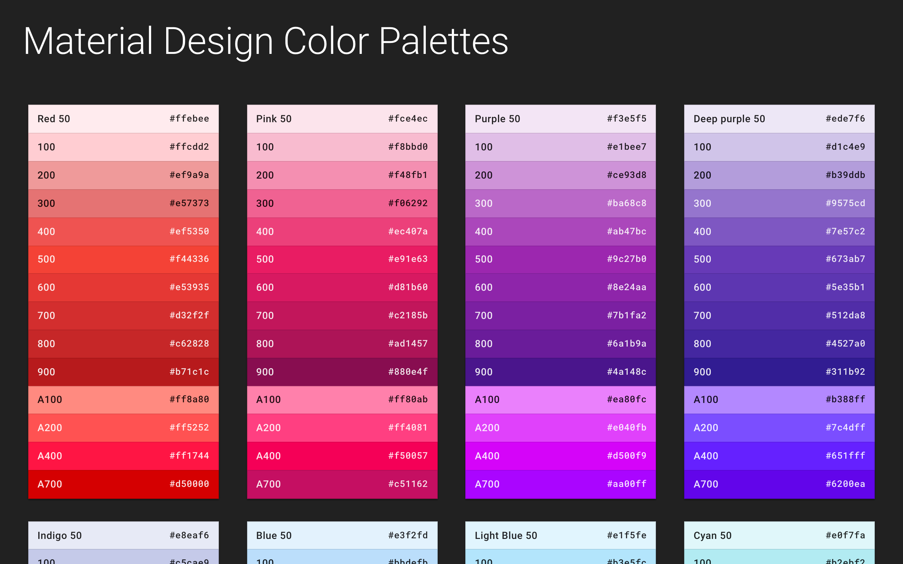

# 🎨 Hue - Material Design Color Palettes

Hue helps creators make good color choices.



## Getting Started

### Installing

Clone the repository

```console
git clone https://github.com/bpholbrook/hue.git
```

Install the dependencies

```console
cd Hue
npm install
```

Launch the development server

```console
npm start
```

## Running the tests

### Test rendering

```console
npm test
```

### Test deployment

```console
npm run build
npm run serve
```

## Deployment

Deploy to GitHub Pages

```console
npm run deploy
```

## Built With

- [React](https://reactjs.org/)
- [Create React App](https://facebook.github.io/create-react-app/)
- [Google Fonts](https://fonts.google.com/)
- [Express](https://expressjs.com/)

## Author

- [Brian Holbrook](https://github.com/bpholbrook)

## License

This project is licensed under the MIT License - see the LICENSE.md file for details

## Acknowledgments

- [Material Design](https://material.io/)